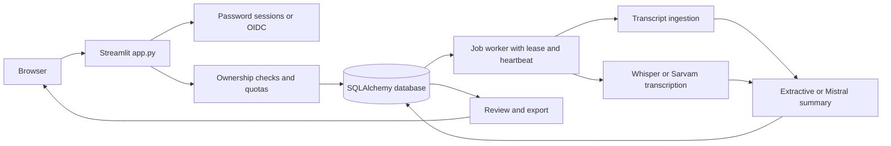

# Briefly architecture and operating boundaries

Briefly is a Python application for turning meeting transcripts or supported audio uploads into reviewable summaries and action items. Streamlit provides the interface, SQLAlchemy provides persistence, and optional external providers add generative summarization or transcription. The default configuration can demonstrate the workflow without a paid API key using explicitly labeled extractive output.

The implementation provides a controlled pilot foundation. Enterprise readiness also requires deployment-specific load testing, recovery exercises, access review, operational ownership, and evidence that the configured providers meet the organization's requirements. It does not imply an uptime SLA or security/compliance certification.

## Request and processing path

The database holds application records, job state, authentication sessions, and audit events. Production configuration requires external PostgreSQL. Local SQLite supports development and demonstrations. User interfaces must not be the only access-control boundary: data access and mutations need the authenticated user's ownership or permission checks in the service layer.

## Authentication and access

Password mode uses Argon2 password hashes and opaque database-backed sessions with an eight-hour lifetime. Production disables open signup by default and disables the demo bypass. A deployment operator provisions the initial owner through `python -m briefly.cli create-owner` in a trusted environment configured for the production database. Adding production team members requires verified OIDC identities; password mode does not supply email verification.

OIDC mode uses Streamlit's native identity flow and requires approved domains in `OIDC_ALLOWED_DOMAINS` and verified email claims for new account provisioning. Identity and authorization are separate responsibilities. The domain allowlist is an admission rule, not a substitute for record-level ownership checks. Native OIDC session-cookie behavior follows Streamlit rather than the application's password-session lifetime. [Streamlit authentication](https://docs.streamlit.io/develop/concepts/connections/authentication).

Quotas bound individual usage, and audit events provide application-level activity records. They do not constitute a tamper-proof audit archive: a database administrator can still change database contents. Organizations needing immutable retention should export audit events to separately controlled storage.

## Jobs and external integrations

Job state is persisted in the database. Processing obtains an expiring lease and updates its heartbeat so abandoned work can become eligible for recovery. The default worker is a single thread in the application process. This keeps deployment simple, but does not provide continuous processing when the host is asleep or unavailable.

For independently operated workers, disable the embedded worker with `BRIEFLY_EMBEDDED_WORKER=false` and run `python -m briefly.worker` under a process supervisor. Recovery and retries must be tested against PostgreSQL in the deployment environment. A durable job record does not by itself prove exactly-once execution: retries around provider calls can repeat a request and incur repeated usage charges.

`TRANSCRIPTION_BACKEND` selects disabled audio, local Whisper, or the Sarvam API. Whisper requires `requirements-whisper.txt`, provisioned weights, and enough compute for inference; model downloads remain disabled unless `WHISPER_ALLOW_DOWNLOAD=true` is explicitly configured. The default model is `small` with CPU `int8` inference. Sarvam supports Hindi/Hinglish PCM WAV in this adapter. Mistral is optional for generative summaries. Without its key, the application clearly uses extractive mode. Provider output needs human review before treating extracted action items or summaries as authoritative.

## Data lifecycle

Uploads have a 25 MB limit and are stored temporarily in the database. The raw upload is removed after successful transcription, before analysis, so retries can reuse the persisted transcript. Failed transcription jobs may retain their upload until handled. Owners archive meetings; the operator's `maintenance` command permanently purges those archived for more than 30 days and clears expired sessions and rate-limit records. Before that purge, the operator can restore an archived meeting. Maintenance does not remove active records or audit events by age and is not automatically scheduled. An operational retention policy must cover those cases as well as transcripts, outputs, and audit records. This database upload strategy is appropriate for modest pilot volume. Large media should move to object storage with access controls, lifecycle rules, and job references.

Schema initialization uses committed Alembic revisions, PostgreSQL advisory locking, and model/schema checks. Startup rejects unversioned existing application tables and unsupported or drifted schemas. Database changes still need a reviewed release plan, migration permissions, a pre-release backup, and a separately tested restore procedure.

Back up PostgreSQL outside the app host, define recovery-point and recovery-time objectives, and prove a restore in a separate environment. Local files and Streamlit session/cache state are disposable on Community Cloud. [Runtime file persistence](https://docs.streamlit.io/develop/concepts/configuration/serving-static-files).

## Pilot limits and hardening path

| Current boundary | Validation or extension before wider production use |
| --- | --- |
| Community Cloud can sleep after 12 hours of inactivity and has variable resource caps | Measure cold start, concurrency, memory, and error rates. Use controlled hosting when required availability cannot tolerate sleep or shared limits. |
| Embedded single-thread worker | Add separately supervised workers and monitor queue age, lease expiry, and job failures when continuous processing is needed. |
| Temporary uploads in the relational database | Adopt object storage and explicit failed-upload cleanup for larger volumes and retention commitments. |
| Application-level quotas and audit events | Validate abuse controls under concurrent requests; export security events to centrally retained monitoring. |
| Password or OIDC access | Review account provisioning and revocation, confirm ownership isolation, and apply organization identity policies. |
| Optional external AI and transcription APIs | Approve provider regions, retention, quota, costs, and model behavior using representative data. |
| No deployment-specific performance evidence | Run load and failure tests using the target PostgreSQL service and real hosting configuration. |
| Schema evolution over time | Review migration procedures and compatibility, take backups, and test both application rollback and database recovery. |

The hosting constraints above come from [Community Cloud operations](https://docs.streamlit.io/deploy/streamlit-community-cloud/manage-your-app). The proposed hardening work is an engineering recommendation; it is not a statement that those external services have been provisioned or tested.

Use `DEPLOYMENT.md` for exact configuration and the release record. A successful local run, a repository push, and a hosted release are separate milestones. Report a public or private hosted URL only after the actual deployment and its smoke tests have succeeded.
